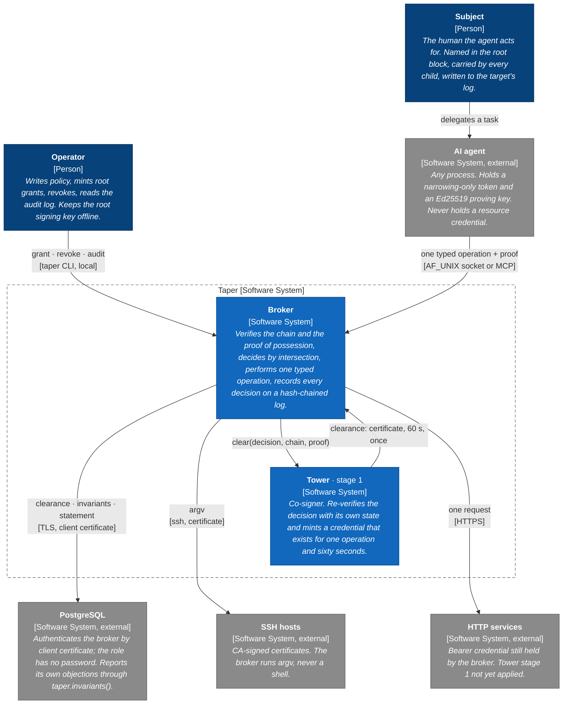
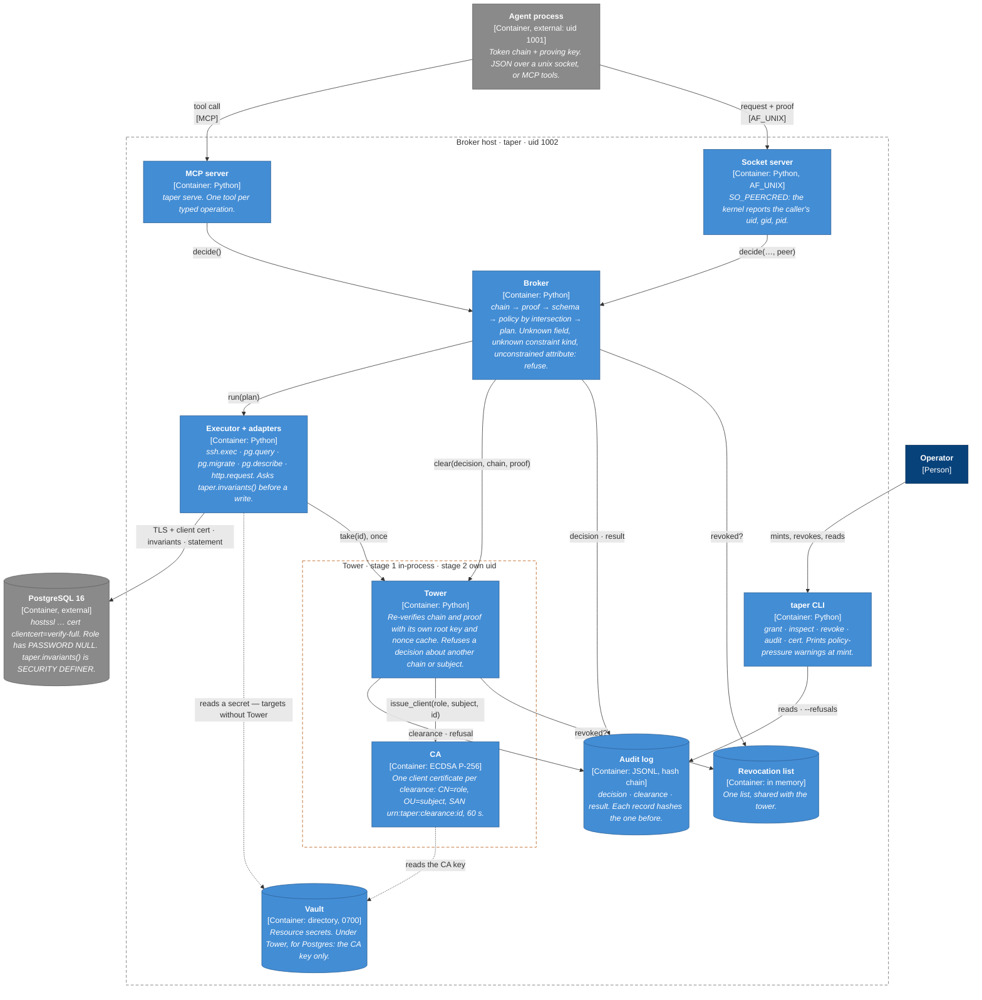
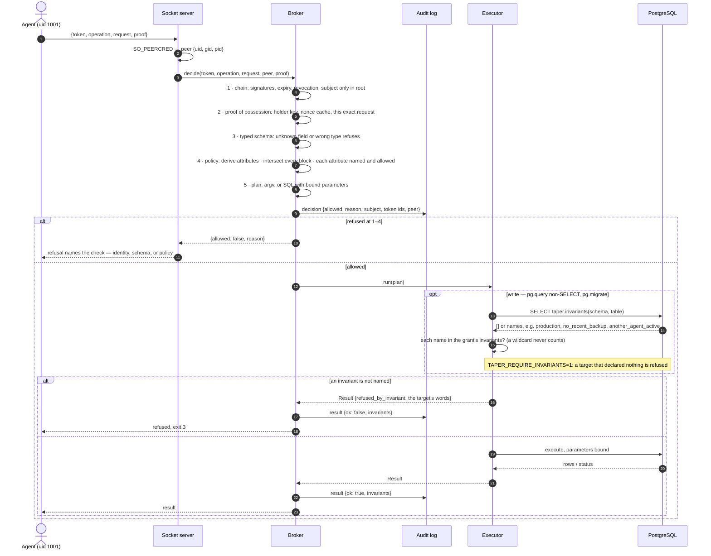
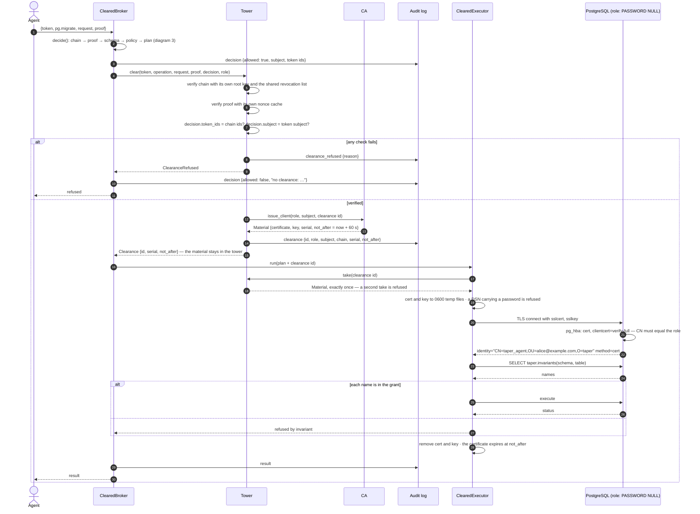
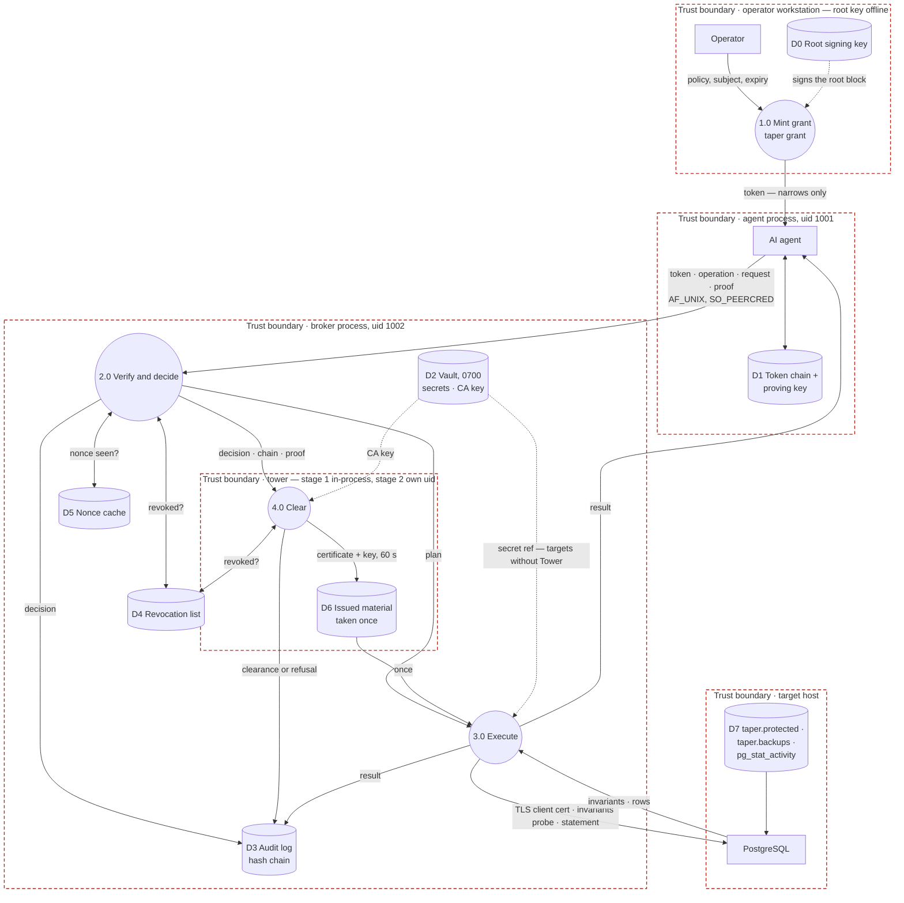
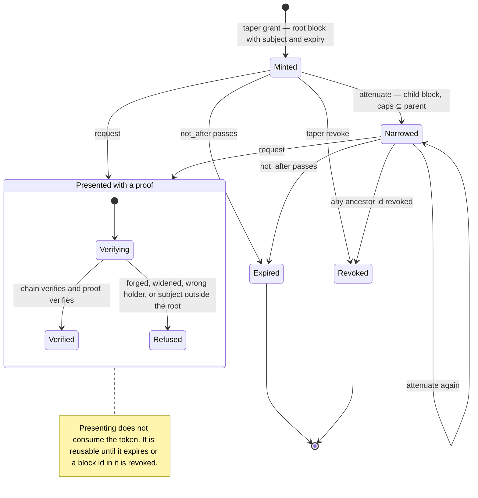
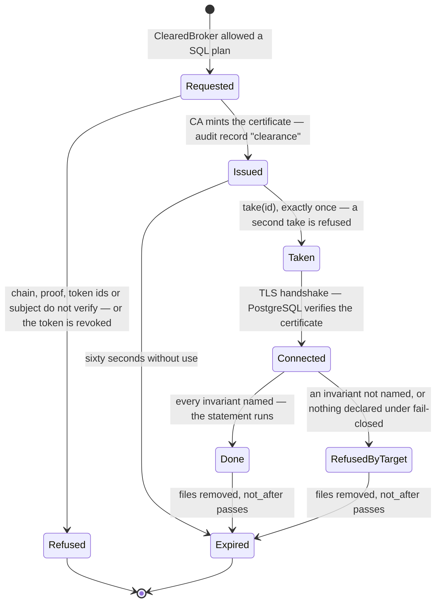

# Architecture diagrams

*Taper v0.3.0 and Tower stage 1, 14 September 2026. Seven diagrams in
standard notation: C4 for the system context and containers, UML 2.5 sequence
diagrams for the two flows, a level-1 data flow diagram with trust boundaries
in the form threat models use, and UML state machines for the two things that
have a lifecycle. Every element names a real component in this repository;
where a box is design and not code, its label says so. Sources are Mermaid, so
GitHub renders them here; `scripts/build-diagrams.py` lifts the same fences
into `site/diagrams.html`, published at
[walex4.github.io/taper/diagrams.html](https://walex4.github.io/taper/diagrams.html).*

Notation: C4 as defined by Simon Brown (c4model.com); sequence and state
machine diagrams per UML 2.5.1 (OMG formal/2017-12-05); data flow diagram with
Gane–Sarson process and store shapes and trust boundaries as used in
Microsoft SDL threat modelling. Prose about the mechanisms is in
[DESIGN.md](../DESIGN.md) and [no-vault.md](no-vault.md); this file is the
pictures.

## 1 · System context (C4 level 1)

Who talks to Taper, and what Taper talks to. The agent is outside the box on
purpose: it is any process, and the design assumes it is compromised.

## 2 · Containers (C4 level 2)

What runs where. Two process boundaries today — agent and broker, separated
by the kernel — and the tower's boundary, which in stage 1 is a code path
inside the broker and in stage 2 becomes its own uid.

## 3 · The decision (UML sequence)

One request, in order. The order is the security property: "you are not the
holder" is decided before anything about what the holder may do.

## 4 · The clearance (UML sequence)

Tower stage 1, Postgres. The same decision as above, then a second party is
asked, and the credential exists only because it said yes.

## 5 · Data flow with trust boundaries (DFD level 1)

The threat-model view. Circles are processes, cylinders are stores,
rectangles are external entities, dashed frames are trust boundaries. The
claim of the design is that no store inside the agent's boundary holds a
credential, and under Tower no store anywhere holds one that outlives an
operation.

## 6 · A token's lifecycle (UML state machine)

A token and a clearance are the two things in the system that have states.

## 7 · A clearance's lifecycle (UML state machine)

Revoking a token is the go-around: from that moment the tower refuses every
clearance that token or any child of it asks for. A clearance already issued
is not recalled; it is one operation and expires within sixty seconds.

## What is design and what is code

Every container in diagram 2 exists except the stage-2 uid boundary around
the tower, which is drawn as a boundary because the interface was written for
it and is in stage 1 a boundary in the code path only. Diagram 4 is verified
against a real PostgreSQL 16 (`validate/check_postgres.py`, the tower
section). Diagram 5's claim about D2 — CA key only — holds for Postgres under
Tower and not yet for SSH or HTTP, whose secrets the vault still holds.
